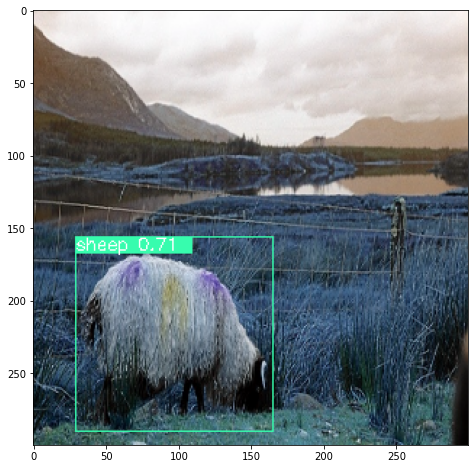
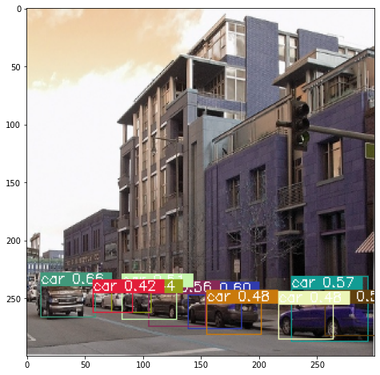

# SSD-Tensorflow2
Object Detection in tf2 with SSD

### Introduction

This is an implementation in tensorflow2.X of the SSD network described in the paper https://paperswithcode.com/paper/ssd-single-shot-multibox-detector:

* Liu, Wei & Anguelov, Dragomir & Erhan, Dumitru & Szegedy, Christian & Reed, Scott & Fu, Cheng-Yang & Berg, Alexander. (2016). *SSD: Single Shot MultiBox Detector.* 9905. 21-37. 10.1007/978-3-319-46448-0_2.

Unlike other implementations, this is a good compromise between code readability and efficiency. The structure of the network was made very simple (expecially the call function) thanks to a new class **Network_Indexer**, able to perform indexable calls on specific layers of a network. Furthermore, instead of the standard Tensorflow dataloader, a customized dataloader has been used, in order to allow the expansion of this repository also to other object detection methods.

### Training

It's simple to train the SSD by choosing the desired parameters in the configuration file and execute the *train.py* file like:
```
$ python train.py
```
Before the training, it's possible to build automatically the dataset by exploiting the scripts in the data folder (only voc script for now). The implementation is meant for training on the most important object detection dataset, which are **COCO** and **Pascal VOC**. Regarding the latter, there are two possible choice of training:
* VOC 07+12 = VOC2012 trainval + VOC2007 trainval -> test on VOC2007
* VOC 07++12 = VOC2012 trainval + VOC2007 trainval + VOC2007 test -> test on VOC2012

These are the training graphs after 10k iterations:

| | |
|---|---|
|  |  |

The mAP obtained with this training time (10k iterations) is quite low, but anyway it's a good starting point for reasoning about this dataset limitation. This table shows that **mAP** = **0.422**

|             |    AP    |              |    AP    |
|-------------|----------| -------------|----------|
|aeroplane    |  0.4832  | diningtable  |  0.4209  |
|bicycle      |  0.5093  | dog          |  0.6368  |
|bird         |  0.3785  | horse        |  0.6001  |
|boat         |  0.2077  | motorbike    |  0.5752  |
|bottle       |  0.0778  | person       |  0.4815  |
|bus          |  0.5374  | pottedplant  |  0.1206  |
|car          |  0.5316  | sheep        |  0.2753  |
|cat          |  0.7129  | sofa         |  0.4453  |
|chair        |  0.1333  | train        |  0.6054  |
|cow          |  0.1931  | tvmonitor    |  0.5035  |

Another interesting training choice can be made on the loss function, indeed the paper https://paperswithcode.com/paper/distance-iou-loss-faster-and-better-learning introduces new kinds of losses based on the IoU, in particular the Distance-IoU:

* Zheng, Zhaohui & Wang, Ping & Liu, Wei & Li, Jinze & Ye, Rongguang & Ren, Dongwei. (2020). *Distance-IoU Loss: Faster and Better Learning for Bounding Box Regression.* Proceedings of the AAAI Conference on Artificial Intelligence. 34. 12993-13000. 10.1609/aaai.v34i07.6999. 

A Colab Notebook is also made available ([`SSD_Notebook.ipynb`](notebooks/SSD_Notebook.ipynb)), allowing the people to interact with this implementation or to train the SSD on Colab GPU: normally it isn't possible because of the colab limitations, but thanks to some train utilities in this work, one can exploit Google Drive to save automatically ALL the training data (including iterations and loss arrays) in order to continue the training after interruption and plot trends) or load it when starting from a previous training session.

### Testing

Regarding the test, it's similar to the previous session: it's sufficient to change the test parameters in the configuration file and then test a trained SSD with:
```
$ python test.py
```
The test is better exploited on the Notebook, in which there is a dedicated section.

### Results

At this moment the SSD is trained only for 10k iterations on VOC 07+12. The trained was suspended in order to test the new type of losses and allow a code revision. The complete mAP results and the trained model will be published when the network is trained for at least 100k iterations. For now, here are some prediction examples at this level of training with SSD300 and the original smooth-l1 regression loss:

| | |
|---|---|
|  |  |
|  |  |

### TODO

1. Complete the train
2. Add COCO script
4. Add the SSD512 structure
4. Try different base networks
5. Test on videos

  
  
***Sources of inspiration***:
- https://github.com/amdegroot/ssd.pytorch
- https://github.com/ChunML/ssd-tf2
- https://github.com/calmisential/TensorFlow2.0_SSD
- https://github.com/pierluigiferrari/ssd_keras
- https://towardsdatascience.com/implementing-ssd-in-keras-part-i-network-structure-da3323f11cff
